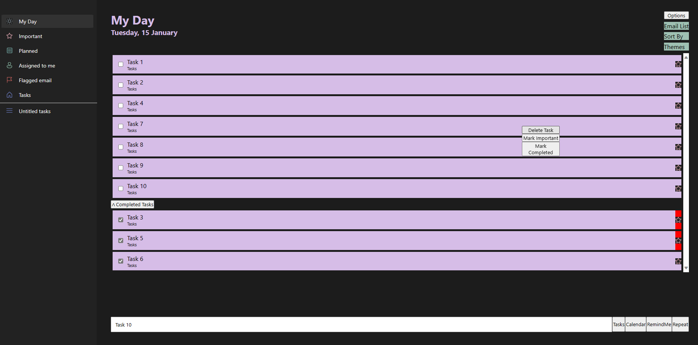

  <h1 style="font-size: 50px;">Hi, I'm Pulkit Kakar</h1>
  

## 😊 About Me
Full stack developer with a strong foundation in MERN stack along with various other technologies such as NextJS, Docker, tRPC, GraphQL and many more. 

## 👩‍💻 Skills

  &nbsp;
  &nbsp;
  &nbsp;
  &nbsp;
  &nbsp;
  &nbsp;
  &nbsp;
  &nbsp;
  &nbsp;
  &nbsp;
  &nbsp;
  &nbsp;
  &nbsp;
  
  
  &nbsp;
  &nbsp;
  &nbsp;
  &nbsp;

- **Programming Languages:** `JavaScript`, `TypeScript`, `C++`, `Java`, `SQL`
- **Frameworks:** `ReactJS`, `NextJS`, `ExpressJS`
- **Database:** `SQL`, `MongoDB`
- **Cloud / DevOps technologies:** `AWS`, `Docker`, `Docker compose`, `GitHub Actions`
- **Data-transfer technologies:** `REST API`, `GraphQL`, `TRPC`

  

## 🔮 Projects

### Skillled.ca | [Course selling application](https://github.com/pkakar00/course-selling-app) 🏫
- Developed a full stack web app using `React`, `MongoDB`, `ExpressJS`, `TypeScript`.
- Developed a secure authentication system using `JWT` tokens for user authentication and maintaining data on server side.
- Integrated `Stripe` payment gateway to receive payments from students in a secure manner. 
- Created client and admin side for adding new courses, editing existing ones.
- Maintained `Typescript` Types between frontend and backend using `NPM` packages in a mono-repository fashion.
- Deployed the application using AWS EC2 instance as a server and github actions for automated deployment.
- Containerized the application using `Docker` and `docker-compose`. 

  

### Microsoft Todo clone | [Todo List application](https://github.com/pkakar00/microsoft_todo) 📝
- Implemented the user interface and responsive design using `React` components and `CSS`.
- Integrated task management features such as creating, updating, and deleting tasks, sorting alphabetically and by   time, as well as organizing them into lists to increase user productivity.
- Created a similar UI design as that of Microsoft Todo.
- Employed state management techniques (`React Context`, `useReducer` hook) to efficiently handle application state.

  

### Purple Notes | [Notes taking application](https://github.com/pkakar00/purple_notes) 🖊️
- Coded a Note taking application that using vanilla `Javascript`, `HTML`, `CSS`.
- Utilized `MySQL` database for storing application data and user information, including names, email addresses, passwords and implemented CRUD (Create, Read, Update, Delete) operations for managing notes, enabling users to add, edit, and delete their notes.
- Created dynamic routes, middleware using `ExpressJS` and templates using `Handlebars` for rendering the application's views and supporting efficient rendering of notes.
- Implemented user authentication and authorization functionality, allowing users to sign up, sign in, and maintain a secure session.

  

## 🤝 Connect with Me

Feel free to reach out to me on [LinkedIn](https://www.linkedin.com/in/pulkit-kakar-bb4341118/), [Gmail](pulkitkakkar6@gmail.com), [Instagram](@pulkitkakkar7).

---